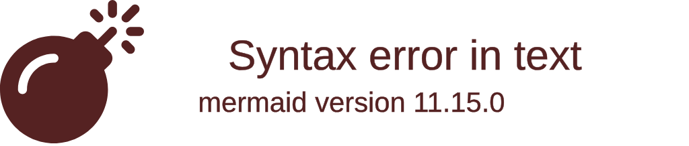

Architecture du projet :

```mermaid
architecture-beta
    group serendipity(cloud)[Serendipity]
    group extern(internet)[Exterieur]

    service sfrontend(internet)[Serendipity Frontend] in extern
    service suser(server)[Srendipity User] in serendipity
    service srecipe(server)[Serendipity Recipe] in serendipity
    service sai(server)[Serendipity AI] in serendipity
    service sauth(server)[Serendipity Auth] in serendipity

    sfrontend:B --> T:sauth
    sauth:B --> T:suser
    sauth:B --> T:sai
    sauth:B --> T:srecipe

    align row sai suser srecipe
    align column sfrontend sauth suser
```
