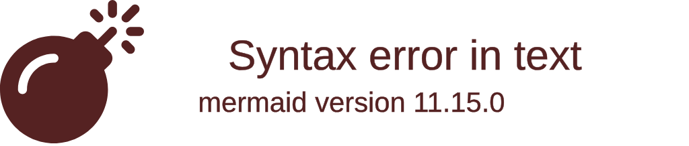

Architecture du projet :

```mermaid
architecture-beta
    group serendipity(cloud)[Serendipity]
    group extern(internet)[Exterieur]

    service sfrontend(internet)[Insightfuel Frontend] in extern
    service suser(server)[Insightfuel User] in serendipity
    service srecipe(server)[Insightfuel Recipe] in serendipity
    service sai(server)[Insightfuel AI] in serendipity
    service sauth(server)[Insightfuel Auth] in serendipity

    sfrontend:R --> L:sauth
    sauth:R --> L:suser
    sauth:R --> L:sai
    sauth:R --> L:srecipe

    align column sai suser srecipe
    align row sfrontend sauth suser
```
